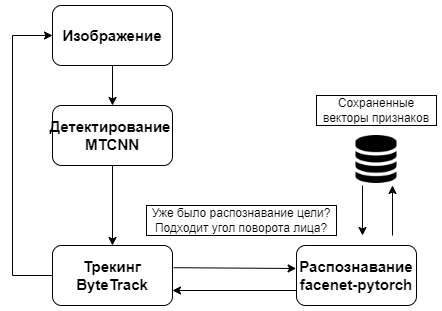

# Tracking-and-Recognition
Была реализована система трекинга и распознавания лиц. Проведено тестирование методов детектирования, распознавания и трекинга лиц. В итоговой системе ля распознавания лиц используется библиотека facenet-pytorch, для детектирования используется MTCNN, для трекинга используется метод ByteTrack.

## Описание содержимого файлов

* ssd_detection.py, mtcnn_detection.py: содержат тестирование методов детектирования лиц
* celeba.py, chokepoint.py, masked.py, facenet_celeba_embedding.py, facenet_chokepoint_embedding.py, masked_embedding.py, face_recognition.py, face_recognition_embedding.py: содержат получение шаблонных векторов признаков и тестирование методов распознавания лиц
* chokepoint_annot.py: содержит преобразование аннотации с координатами глаз к аннотации с координатами ограничивающих лица прямоугольников
* system.py: содержит код с применением всех выбранных методов
* bytetrack.py, sort.py: содержат тестирование методов трекинга лиц

## Используемые методы (выбраны по результатам экспериментов)
* В качестве метода детектирования лиц была выбрана MTCNN.
* Для распознавания лиц выбрана библиотека facenet-pytorch.
* Методом трекинга выбран ByteTrack.

##  Реализация
 * Наличие GPU не является обязательным условием, однако позволяет ускорить детектирование и распознавание в несколько раз (например, при проведении экспериментов, скорость работы MTCNN увеличилась в 4 раза).
 * Код итоговой системы представлен в system.py.
 * Предварительно необходимо получить хотя бы одно изображение для каждого субъекта и сохранить векторы признаков, чтобы с ними потом осуществлялось сравнение. В данной реализации векторы признаков были сохранены в файлах с расширением .npy (embedding_facenet_torch.npy). Примеры получения векторов признаков представлены в facenet_chokepoint_embedding.py, masked_embedding.py, facenet_celeba_embedding.p.
 * На вход системы можно передавать как статические изображения, так и поток кадров.
 * Обновление целей трекинга происходит с помощью метода update(). У новых целей идентификаторы больше идентификаторов уже отслеживаемых целей.
 * Если необходимо измерять угол поворота головы, то изначально нужно откалибровать камеру (например, используя OpenCV) и получить коэффициенты искажения и матрицу камеры: dist_koeffs.npy и camera_matrix.npy. Затем использовать функцию из файла angle.py. На вход передаются координаты найденных ограничивающих прямоугольников (faces) и координаты ключевых точек (landm). Их значения могут быть получены по результатам работы MTCNN, что реализовано в файле system.py.
 * Программа также позволяет записать видео с выделенными прямоугольниками и именами распознанных субъектов. Для этого используется объект VideoWriter из библиотеки OpenCV. Для отрисовки могут быть использованы методы rectangle() и putText() библиотеки OpenCV, как предложено в файле system.py.

## Схематическое представление системы

